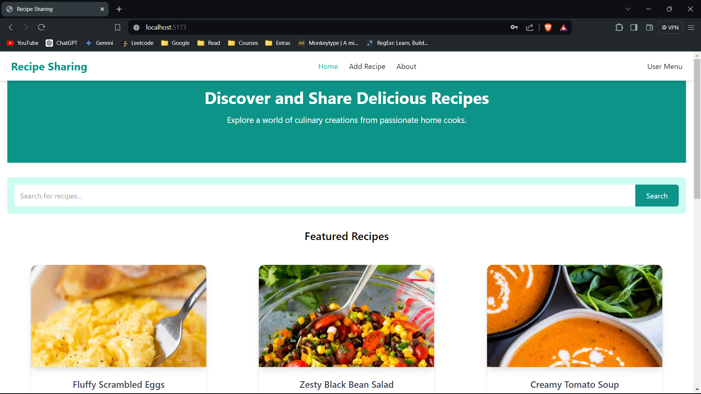
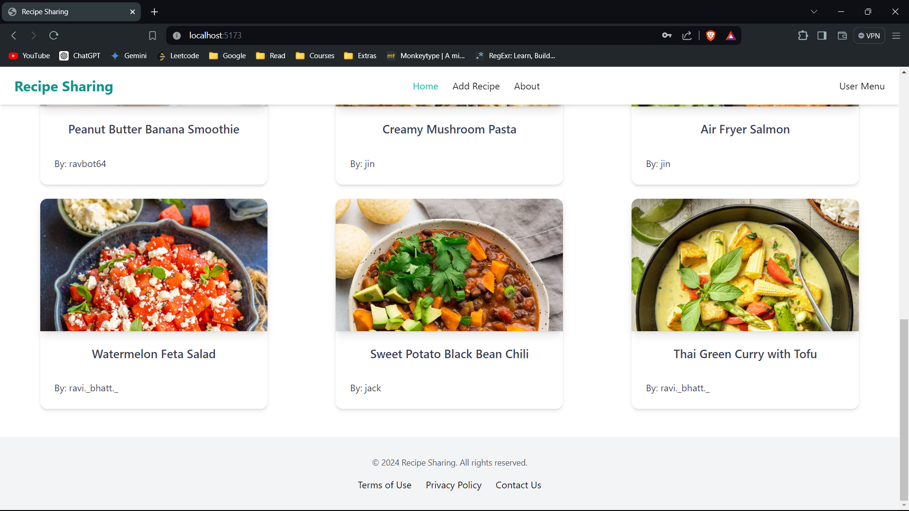
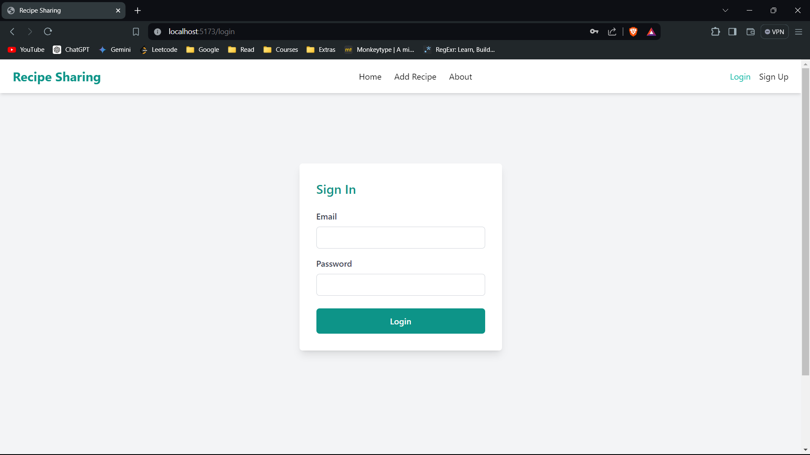
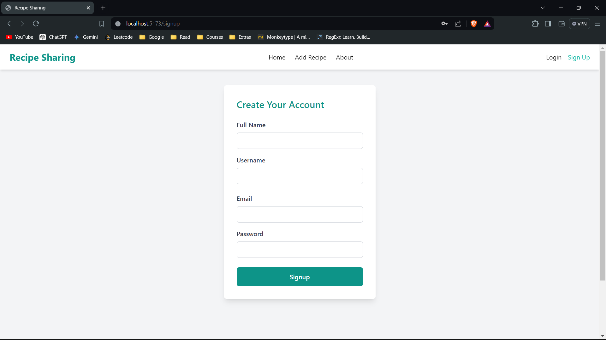
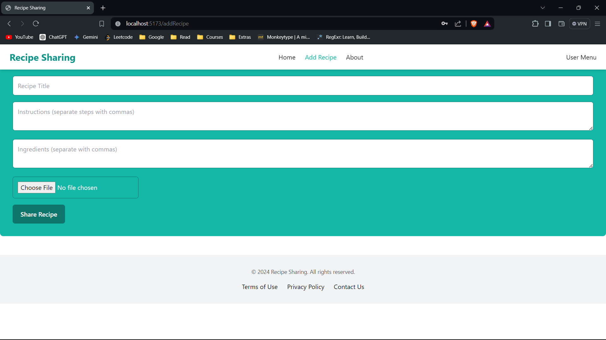
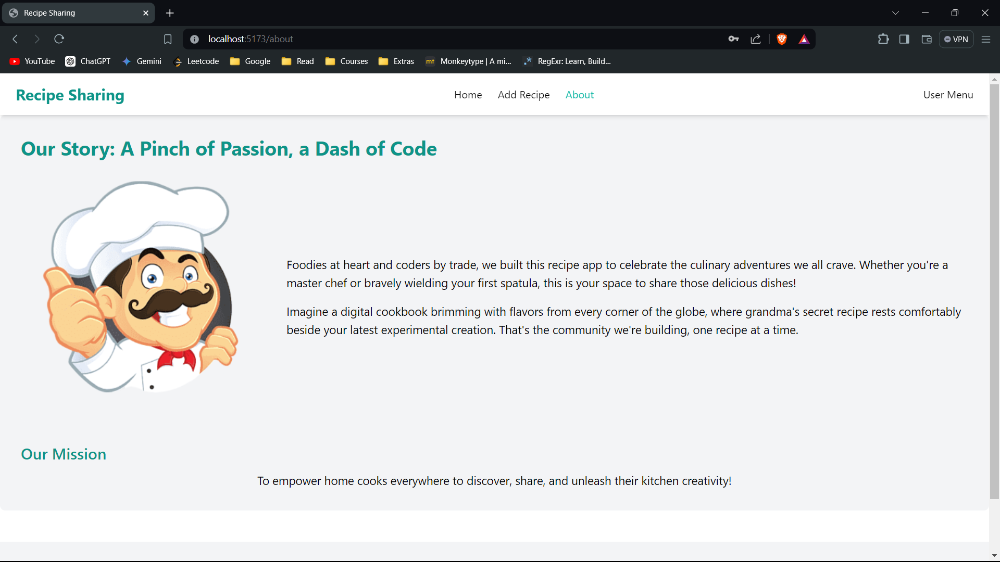
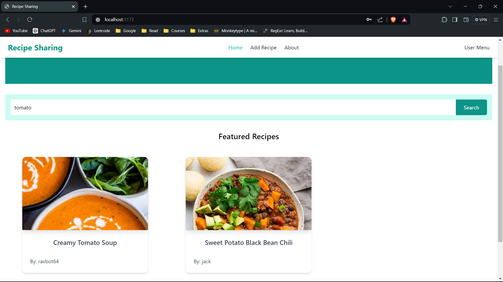
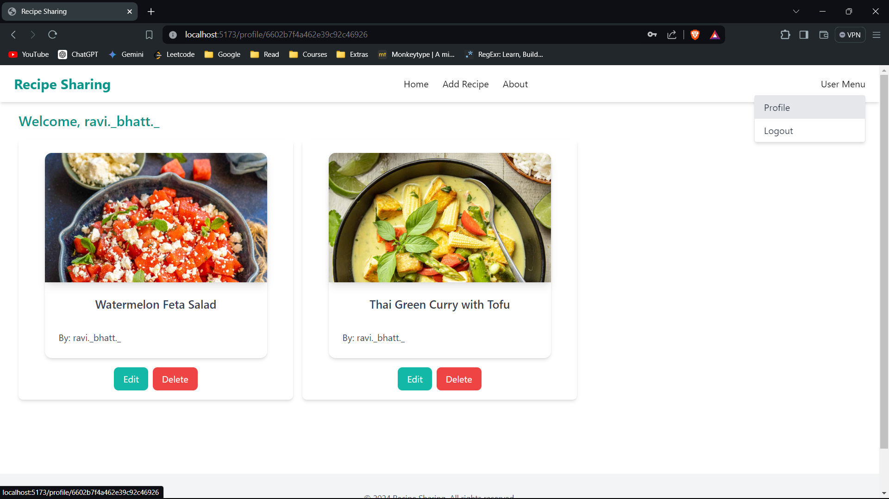
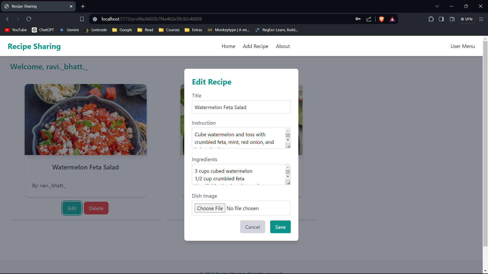

# Recipe Sharing

## Overview

Recipe Sharing is a platform for food enthusiasts to discover new recipes, share their culinary creations,.

## Features

* Search for recipes by ingredients, keywords.
* Ability to upload and share your own recipes.
* Edit your already uploaded recipe.
* Delete existing recipe.

## Technologies

* **Frontend:** React.js
* **Backend:** Node.js / Express.js
* **Database:** MongoDB

## Installation

**Prerequisites**

* Node.js (version 12 or above)
* MongoDB

## How to Run

1. Navigate into the backend directory: `cd backend`
2. Start the backend development server: `npm run dev`
3. Open a new terminal window or tab.
4. Navigate into the frontend directory : `cd recipeSharing`
5. Start the frontend development server: `npm run dev`

## Screenshots

### Homepage

### Login Page

### Signup Page

### AddRecipe Page

### About Page

### Search

### User Profile Page

### Edit Recipe

